# Personal Budget

<h2>PL</h2>

<b>Personal Budget</b> - to narzędzie, które pomaga zarządzać budżetem osobistym poprzez
śledzenie wydatków i przychodów. Backend aplikacji jest oparty na PHP,
frontend składa się z HTML, CSS, JavaScript, AJAX i Bootstrap,
co zapewnia łatwość użytkowania i responsywność.
Dzięki tej aplikacji możesz łatwo dodawać wydatki i przychody,
ustawiać cele oszczędnościowe i śledzić postęp w osiąganiu ich.
Dodatkowo, aplikacja oferuje raportowanie i analizę wydatków,
co pozwala na lepsze zrozumienie swoich zwyczajów finansowych i oszczędzanie
większych kwot w dłuższej perspektywie.

<b>Technologie:
- PHP
- HTML
- CSS
- Bootstrap
- AJAX
</b>

<h2>ENG</h2>

<b>Personal Budget</b> - is a tool that helps manage personal finances by tracking expenses and income.
The application's backend is based on PHP, while the frontend consists of HTML,
CSS, JavaScript, AJAX, and Bootstrap, ensuring ease of use and responsiveness.
With this application, you can easily add expenses and income, set savings goals,
and track progress towards achieving them. Additionally,
the application offers expense reporting and analysis,
which allows for a better understanding of financial habits and the ability to save
larger amounts in the long term.

<b>Technologies:
- PHP
- HTML
- CSS
- Bootstrap
- AJAX
</b>

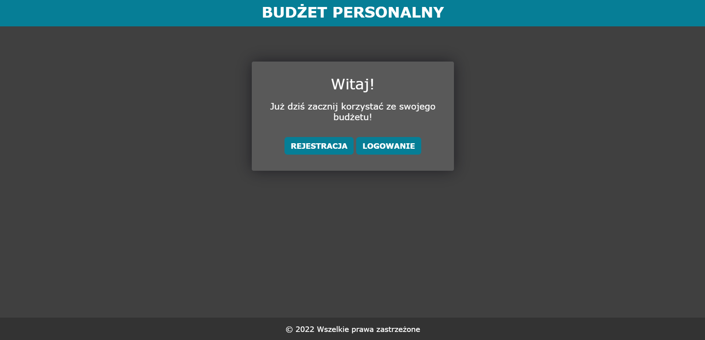
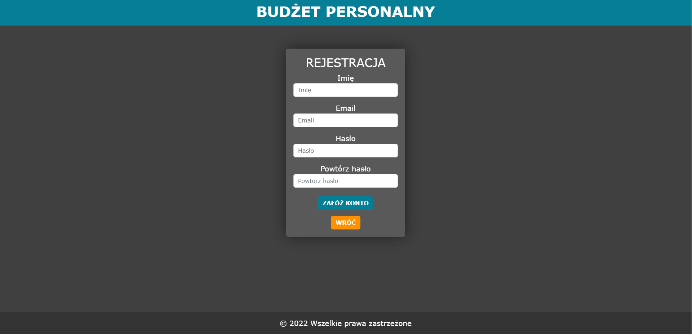
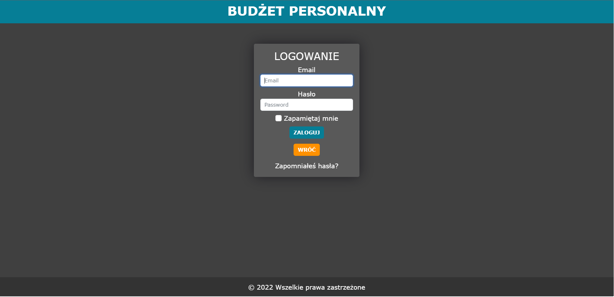
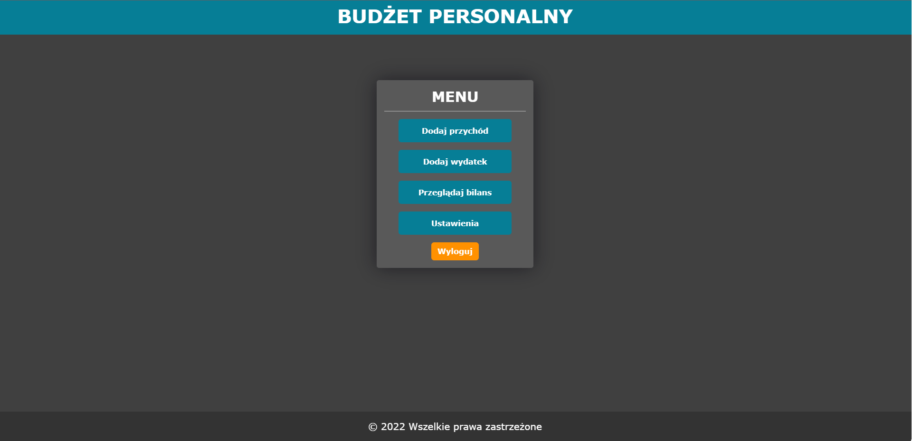
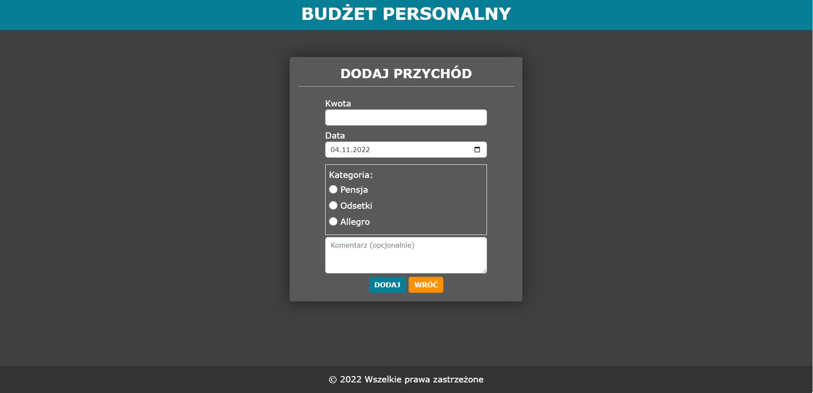
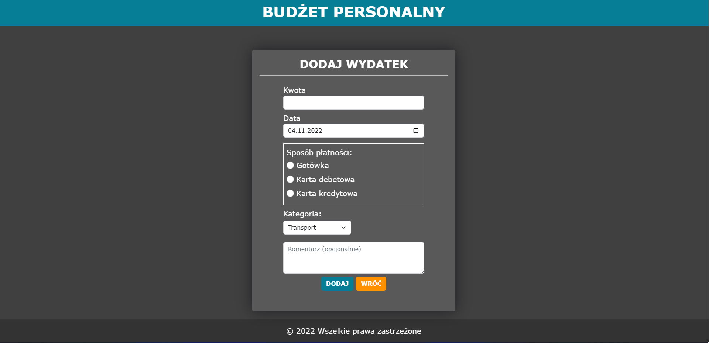
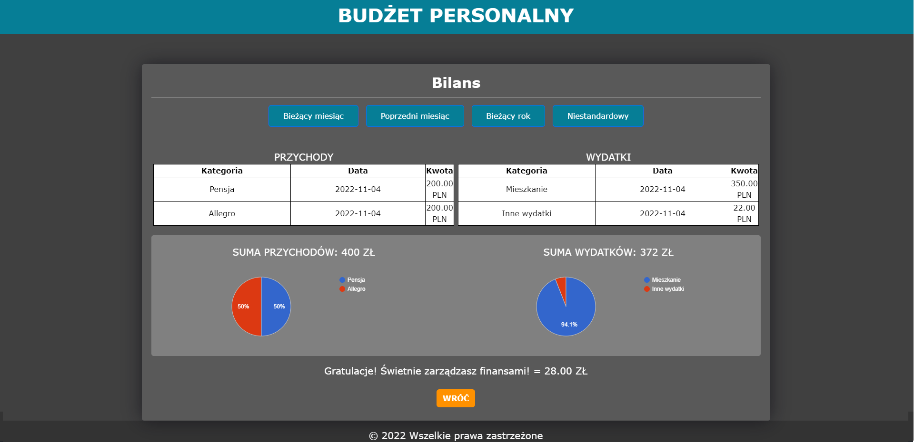
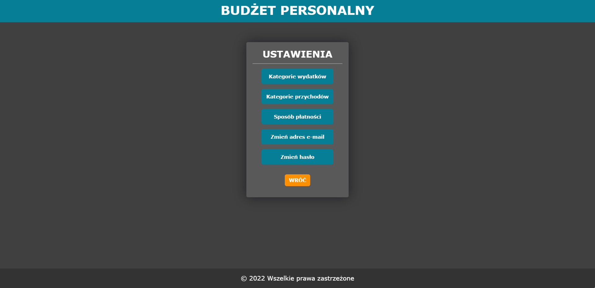
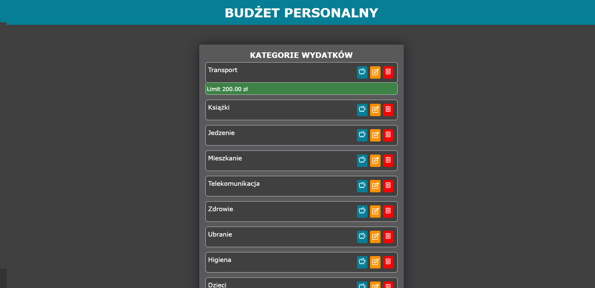
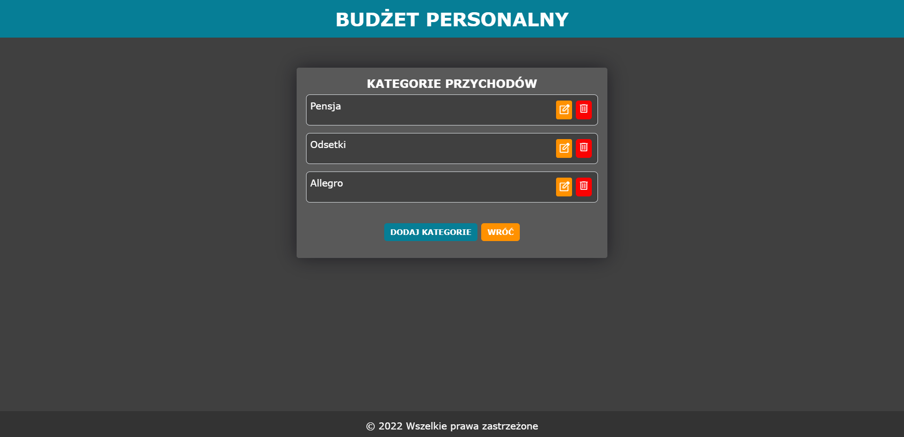
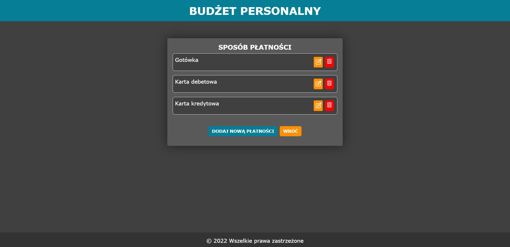

https://budget.mateusz-szwed.profesjonalnyprogramista.pl/